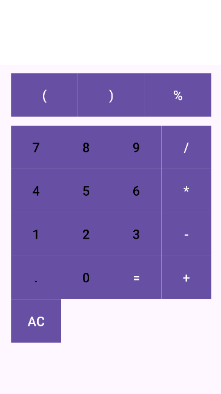

# EXPERIMENT NO 4: Android User Interface Design  
**Objective:** To implement different types of layouts like Linear, Relative, Grid, and Table.

## 1. Linear Layout Example

Linear Layout arranges elements in a single direction - either horizontally or vertically.

```xml
<LinearLayout
    xmlns:android="http://schemas.android.com/apk/res/android"
    android:layout_width="match_parent"
    android:layout_height="match_parent"
    android:orientation="vertical"
    android:padding="16dp">

    <TextView
        android:layout_width="wrap_content"
        android:layout_height="wrap_content"
        android:text="Linear Layout Example" />

    <Button
        android:layout_width="wrap_content"
        android:layout_height="wrap_content"
        android:text="Click Me" />
</LinearLayout>
```

## 2. Relative Layout Example

Relative Layout positions elements in relation to parent or other elements.

```xml
<RelativeLayout
    xmlns:android="http://schemas.android.com/apk/res/android"
    android:layout_width="match_parent"
    android:layout_height="match_parent"
    android:padding="16dp">

    <TextView
        android:id="@+id/textView"
        android:layout_width="wrap_content"
        android:layout_height="wrap_content"
        android:text="Relative Layout Example" />

    <Button
        android:layout_width="wrap_content"
        android:layout_height="wrap_content"
        android:layout_below="@id/textView"
        android:text="Click Me" />
</RelativeLayout>
```

## 3. Grid Layout Example

Grid Layout arranges elements in a grid of rows and columns.

```xml
<GridLayout
    xmlns:android="http://schemas.android.com/apk/res/android"
    android:layout_width="match_parent"
    android:layout_height="wrap_content"
    android:columnCount="2"
    android:padding="16dp">

    <Button
        android:layout_width="0dp"
        android:layout_height="wrap_content"
        android:layout_columnWeight="1"
        android:text="Button 1" />

    <Button
        android:layout_width="0dp"
        android:layout_height="wrap_content"
        android:layout_columnWeight="1"
        android:text="Button 2" />
</GridLayout>
```

## 4. Table Layout Example

Table Layout organizes elements into rows and columns like an HTML table.

```xml
<TableLayout
    xmlns:android="http://schemas.android.com/apk/res/android"
    android:layout_width="match_parent"
    android:layout_height="wrap_content"
    android:stretchColumns="*"
    android:padding="16dp">

    <TableRow>
        <TextView
            android:text="Username" />
        <EditText
            android:hint="Enter username" />
    </TableRow>

    <TableRow>
        <TextView
            android:text="Password" />
        <EditText
            android:hint="Enter password"
            android:inputType="textPassword" />
    </TableRow>
</TableLayout>
```

## 5. Practical Example: Registration Form

This example demonstrates a complete registration form using nested LinearLayouts.

```xml
<?xml version="1.0" encoding="utf-8"?>
<ScrollView xmlns:android="http://schemas.android.com/apk/res/android"
    xmlns:app="http://schemas.android.com/apk/res-auto"
    xmlns:tools="http://schemas.android.com/tools"
    android:layout_width="match_parent"
    android:layout_height="match_parent"
    android:padding="16dp"
    tools:context=".RegistrationActivity">

    <LinearLayout
        android:layout_width="match_parent"
        android:layout_height="wrap_content"
        android:orientation="vertical">

        <!-- Form Title -->
        <TextView
            android:layout_width="match_parent"
            android:layout_height="wrap_content"
            android:text="Registration Form"
            android:textSize="24sp"
            android:textStyle="bold"
            android:gravity="center"
            android:layout_marginBottom="8dp"/>

        <!-- Form Description -->
        <TextView
            android:layout_width="match_parent"
            android:layout_height="wrap_content"
            android:text="Fill out the form carefully for registration"
            android:textSize="14sp"
            android:gravity="center"
            android:layout_marginBottom="24dp"/>

        <!-- Student Name Field -->
        <TextView
            android:layout_width="match_parent"
            android:layout_height="wrap_content"
            android:text="Student Name"
            android:textSize="16sp"
            android:layout_marginBottom="8dp"/>

        <LinearLayout
            android:layout_width="match_parent"
            android:layout_height="wrap_content"
            android:orientation="horizontal"
            android:layout_marginBottom="16dp">

            <EditText
                android:id="@+id/editTextFirstName"
                android:layout_width="0dp"
                android:layout_height="wrap_content"
                android:layout_weight="1"
                android:hint="First Name"
                android:padding="12dp"
                android:background="@drawable/edit_text_border"
                android:layout_marginEnd="8dp"
                android:inputType="textPersonName"/>

            <EditText
                android:id="@+id/editTextLastName"
                android:layout_width="0dp"
                android:layout_height="wrap_content"
                android:layout_weight="1"
                android:hint="@string/last_name"
                android:padding="12dp"
                android:background="@drawable/edit_text_border"
                android:inputType="textPersonName"/>
        </LinearLayout>

        <!-- Gender and Email Fields -->
        <LinearLayout
            android:layout_width="match_parent"
            android:layout_height="wrap_content"
            android:orientation="horizontal"
            android:layout_marginBottom="16dp">

            <LinearLayout
                android:layout_width="0dp"
                android:layout_height="wrap_content"
                android:layout_weight="1"
                android:orientation="vertical"
                android:layout_marginEnd="8dp">

                <TextView
                    android:layout_width="match_parent"
                    android:layout_height="wrap_content"
                    android:text="@string/gender"
                    android:textSize="16sp"
                    android:layout_marginBottom="8dp"/>

                <Spinner
                    android:id="@+id/spinnerGender"
                    android:layout_width="match_parent"
                    android:layout_height="wrap_content"
                    android:padding="12dp"
                    android:background="@drawable/spinner_border"/>
            </LinearLayout>

            <LinearLayout
                android:layout_width="0dp"
                android:layout_height="wrap_content"
                android:layout_weight="1"
                android:orientation="vertical">

                <TextView
                    android:layout_width="match_parent"
                    android:layout_height="wrap_content"
                    android:text="@string/student_e_mail"
                    android:textSize="16sp"
                    android:layout_marginBottom="8dp"/>

                <EditText
                    android:id="@+id/editTextEmail"
                    android:layout_width="match_parent"
                    android:layout_height="wrap_content"
                    android:hint="@string/ex_myname_example_com"
                    android:padding="12dp"
                    android:background="@drawable/edit_text_border"
                    android:inputType="textEmailAddress"/>
            </LinearLayout>
        </LinearLayout>

        <!-- Student ID and Classes Fields -->
        <LinearLayout
            android:layout_width="match_parent"
            android:layout_height="wrap_content"
            android:orientation="horizontal"
            android:layout_marginBottom="24dp">

            <LinearLayout
                android:layout_width="0dp"
                android:layout_height="wrap_content"
                android:layout_weight="1"
                android:orientation="vertical"
                android:layout_marginEnd="8dp">

                <TextView
                    android:layout_width="match_parent"
                    android:layout_height="wrap_content"
                    android:text="@string/student_id"
                    android:textSize="16sp"
                    android:layout_marginBottom="8dp"/>

                <EditText
                    android:id="@+id/editTextStudentId"
                    android:layout_width="match_parent"
                    android:layout_height="wrap_content"
                    android:padding="12dp"
                    android:background="@drawable/edit_text_border"
                    android:inputType="text"/>
            </LinearLayout>

            <LinearLayout
                android:layout_width="0dp"
                android:layout_height="wrap_content"
                android:layout_weight="1"
                android:orientation="vertical">

                <TextView
                    android:layout_width="match_parent"
                    android:layout_height="wrap_content"
                    android:text="@string/list_of_classes"
                    android:textSize="16sp"
                    android:layout_marginBottom="8dp"/>

                <Spinner
                    android:id="@+id/spinnerClasses"
                    android:layout_width="match_parent"
                    android:layout_height="wrap_content"
                    android:padding="12dp"
                    android:background="@drawable/spinner_border"/>
            </LinearLayout>
        </LinearLayout>

        <!-- Submit Button -->
        <Button
            android:id="@+id/buttonSubmit"
            android:layout_width="match_parent"
            android:layout_height="wrap_content"
            android:text="Submit"
            android:textColor="#FFFFFF"
            android:backgroundTint="#4CAF50"
            android:padding="12dp"
            tools:ignore="HardcodedText" />

    </LinearLayout>
</ScrollView>
```


## 6. Advanced Example: Calculator UI with ConstraintLayout and GridLayout

This example shows how to create a calculator interface using a combination of ConstraintLayout and GridLayout.

```xml
<?xml version="1.0" encoding="utf-8"?>
<androidx.constraintlayout.widget.ConstraintLayout
    xmlns:android="http://schemas.android.com/apk/res/android"
    xmlns:app="http://schemas.android.com/apk/res-auto"
    xmlns:tools="http://schemas.android.com/tools"
    android:layout_width="match_parent"
    android:layout_height="match_parent"
    tools:context=".MainActivity">

    <!-- Display Screen -->
    <TextView
        android:id="@+id/tvDisplay"
        android:layout_width="0dp"
        android:layout_height="120dp"
        android:background="#FFFFFF"
        android:text=""
        android:textSize="32sp"
        android:gravity="end|center_vertical"
        android:padding="16dp"
        android:textColor="#000000"
        app:layout_constraintTop_toTopOf="parent"
        app:layout_constraintStart_toStartOf="parent"
        app:layout_constraintEnd_toEndOf="parent" />

    <!-- First Row Buttons: AC, (, ), % -->
    <GridLayout
        android:id="@+id/row1"
        android:layout_width="0dp"
        android:layout_height="wrap_content"
        android:layout_marginTop="16dp"
        android:columnCount="4"
        android:rowCount="1"
        app:layout_constraintTop_toBottomOf="@+id/tvDisplay"
        app:layout_constraintStart_toStartOf="parent"
        app:layout_constraintEnd_toEndOf="parent"
        app:layout_constraintWidth_percent="0.9">

        <Button
            android:text="AC"
            android:layout_width="0dp"
            android:layout_height="80dp"
            android:layout_columnWeight="1"
            android:background="#6E7581"
            android:textColor="#FFFFFF"
            android:textSize="24sp" />

        <Button
            android:text="("
            android:layout_width="0dp"
            android:layout_height="80dp"
            android:layout_columnWeight="1"
            android:background="#6E7581"
            android:textColor="#FFFFFF"
            android:textSize="24sp" />

        <Button
            android:text=")"
            android:layout_width="0dp"
            android:layout_height="80dp"
            android:layout_columnWeight="1"
            android:background="#6E7581"
            android:textColor="#FFFFFF"
            android:textSize="24sp" />

        <Button
            android:text="%"
            android:layout_width="0dp"
            android:layout_height="80dp"
            android:layout_columnWeight="1"
            android:background="#6E7581"
            android:textColor="#FFFFFF"
            android:textSize="24sp" />
    </GridLayout>

    <!-- Numeric Buttons and Operators -->
    <GridLayout
        android:id="@+id/numericGrid"
        android:layout_width="0dp"
        android:layout_height="wrap_content"
        android:layout_marginTop="16dp"
        android:columnCount="4"
        android:rowCount="5"
        app:layout_constraintTop_toBottomOf="@+id/row1"
        app:layout_constraintStart_toStartOf="parent"
        app:layout_constraintEnd_toEndOf="parent"
        app:layout_constraintWidth_percent="0.9">

        <!-- Row 1: 7, 8, 9, / -->
        <Button android:text="7" android:layout_width="0dp" android:layout_height="80dp" android:layout_columnWeight="1" android:background="#E3F2FD" android:textColor="#000000" android:textSize="24sp"/>
        <Button android:text="8" android:layout_width="0dp" android:layout_height="80dp" android:layout_columnWeight="1" android:background="#E3F2FD" android:textColor="#000000" android:textSize="24sp"/>
        <Button android:text="9" android:layout_width="0dp" android:layout_height="80dp" android:layout_columnWeight="1" android:background="#E3F2FD" android:textColor="#000000" android:textSize="24sp"/>
        <Button android:text="/" android:layout_width="0dp" android:layout_height="80dp" android:layout_columnWeight="1" android:background="#6E7581" android:textColor="#FFFFFF" android:textSize="24sp"/>

        <!-- Row 2: 4, 5, 6, * -->
        <Button android:text="4" android:layout_width="0dp" android:layout_height="80dp" android:layout_columnWeight="1" android:background="#E3F2FD" android:textColor="#000000" android:textSize="24sp"/>
        <Button android:text="5" android:layout_width="0dp" android:layout_height="80dp" android:layout_columnWeight="1" android:background="#E3F2FD" android:textColor="#000000" android:textSize="24sp"/>
        <Button android:text="6" android:layout_width="0dp" android:layout_height="80dp" android:layout_columnWeight="1" android:background="#E3F2FD" android:textColor="#000000" android:textSize="24sp"/>
        <Button android:text="*" android:layout_width="0dp" android:layout_height="80dp" android:layout_columnWeight="1" android:background="#6E7581" android:textColor="#FFFFFF" android:textSize="24sp"/>

        <!-- Row 3: 1, 2, 3, - -->
        <Button android:text="1" android:layout_width="0dp" android:layout_height="80dp" android:layout_columnWeight="1" android:background="#E3F2FD" android:textColor="#000000" android:textSize="24sp"/>
        <Button android:text="2" android:layout_width="0dp" android:layout_height="80dp" android:layout_columnWeight="1" android:background="#E3F2FD" android:textColor="#000000" android:textSize="24sp"/>
        <Button android:text="3" android:layout_width="0dp" android:layout_height="80dp" android:layout_columnWeight="1" android:background="#E3F2FD" android:textColor="#000000" android:textSize="24sp"/>
        <Button android:text="-" android:layout_width="0dp" android:layout_height="80dp" android:layout_columnWeight="1" android:background="#6E7581" android:textColor="#FFFFFF" android:textSize="24sp"/>

        <!-- Row 4: ., 0, =, + -->
        <Button android:text="." android:layout_width="0dp" android:layout_height="80dp" android:layout_columnWeight="1" android:background="#E3F2FD" android:textColor="#000000" android:textSize="24sp"/>
        <Button android:text="0" android:layout_width="0dp" android:layout_height="80dp" android:layout_columnWeight="1" android:background="#E3F2FD" android:textColor="#000000" android:textSize="24sp"/>
        <Button android:text="=" android:layout_width="0dp" android:layout_height="80dp" android:layout_columnWeight="1" android:background="#F66335" android:textColor="#FFFFFF" android:textSize="24sp"/>
        <Button android:text="+" android:layout_width="0dp" android:layout_height="80dp" android:layout_columnWeight="1" android:background="#6E7581" android:textColor="#FFFFFF" android:textSize="24sp"/>
    </GridLayout>
</androidx.constraintlayout.widget.ConstraintLayout>
```

## Key Layout Concepts

### Linear Layout
- Arranges elements in a single line (horizontal or vertical)
- Uses `android:orientation="vertical"` or `android:orientation="horizontal"`
- Weight attribute (`android:layout_weight`) distributes space proportionally

### Relative Layout
- Positions elements relative to parent or sibling elements
- Common attributes: `android:layout_below`, `android:layout_toRightOf`, `android:layout_alignParentTop`

### Grid Layout
- Organizes content in a grid of rows and columns
- Use `android:rowCount` and `android:columnCount` to define grid size
- `android:layout_columnWeight` distributes column space

### Table Layout
- Similar to HTML tables
- Contains `<TableRow>` elements
- `android:stretchColumns="*"` makes all columns expandable

### ConstraintLayout
- Flexible positioning with constraints to other views or parent
- Reduces nested layouts for better performance
- Uses constraints like `app:layout_constraintTop_toBottomOf`

### Practical Tips
- Use ScrollView for forms that might extend beyond screen
- Nest layouts strategically for complex UIs
- Use weight attributes for proportional sizing
- ConstraintLayout reduces layout nesting and improves performance
