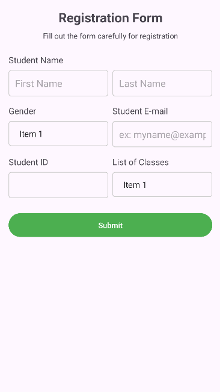

# EXPERIMENT NO 4: Android User Interface Design  
**Objective:** To implement different types of layouts like Relative, Grid, Linear, and Table.

---

## 1. Linear Layout Example

```xml
<LinearLayout
    xmlns:android="http://schemas.android.com/apk/res/android"
    android:layout_width="match_parent"
    android:layout_height="match_parent"
    android:orientation="vertical"
    android:padding="16dp">

    <TextView
        android:layout_width="wrap_content"
        android:layout_height="wrap_content"
        android:text="Linear Layout Example" />

    <Button
        android:layout_width="wrap_content"
        android:layout_height="wrap_content"
        android:text="Click Me" />
</LinearLayout>
```

---

## 2. Relative Layout Example

```xml
<RelativeLayout
    xmlns:android="http://schemas.android.com/apk/res/android"
    android:layout_width="match_parent"
    android:layout_height="match_parent"
    android:padding="16dp">

    <TextView
        android:id="@+id/textView"
        android:layout_width="wrap_content"
        android:layout_height="wrap_content"
        android:text="Relative Layout Example" />

    <Button
        android:layout_width="wrap_content"
        android:layout_height="wrap_content"
        android:layout_below="@id/textView"
        android:text="Click Me" />
</RelativeLayout>
```

---

## 3. Grid Layout Example

```xml
<GridLayout
    xmlns:android="http://schemas.android.com/apk/res/android"
    android:layout_width="match_parent"
    android:layout_height="wrap_content"
    android:columnCount="2"
    android:padding="16dp">

    <Button
        android:layout_width="0dp"
        android:layout_height="wrap_content"
        android:layout_columnWeight="1"
        android:text="Button 1" />

    <Button
        android:layout_width="0dp"
        android:layout_height="wrap_content"
        android:layout_columnWeight="1"
        android:text="Button 2" />
</GridLayout>
```

---

## 4. Table Layout Example

```xml
<TableLayout
    xmlns:android="http://schemas.android.com/apk/res/android"
    android:layout_width="match_parent"
    android:layout_height="wrap_content"
    android:stretchColumns="*"
    android:padding="16dp">

    <TableRow>
        <TextView
            android:text="Username" />
        <EditText
            android:hint="Enter username" />
    </TableRow>

    <TableRow>
        <TextView
            android:text="Password" />
        <EditText
            android:hint="Enter password"
            android:inputType="textPassword" />
    </TableRow>
</TableLayout>
```

---

## 5. Signup Page Example

### Screenshot




### XML Code

```xml
<?xml version="1.0" encoding="utf-8"?>
<ScrollView xmlns:android="http://schemas.android.com/apk/res/android"
    xmlns:app="http://schemas.android.com/apk/res-auto"
    xmlns:tools="http://schemas.android.com/tools"
    android:layout_width="match_parent"
    android:layout_height="match_parent"
    android:padding="16dp"
    tools:context=".RegistrationActivity">

    <LinearLayout
        android:layout_width="match_parent"
        android:layout_height="wrap_content"
        android:orientation="vertical">

        <TextView
            android:layout_width="match_parent"
            android:layout_height="wrap_content"
            android:text="Registration Form"
            android:textSize="24sp"
            android:textStyle="bold"
            android:gravity="center"
            android:layout_marginBottom="8dp"/>

        <TextView
            android:layout_width="match_parent"
            android:layout_height="wrap_content"
            android:text="Fill out the form carefully for registration"
            android:textSize="14sp"
            android:gravity="center"
            android:layout_marginBottom="24dp"/>

        <TextView
            android:layout_width="match_parent"
            android:layout_height="wrap_content"
            android:text="Student Name"
            android:textSize="16sp"
            android:layout_marginBottom="8dp"/>

        <LinearLayout
            android:layout_width="match_parent"
            android:layout_height="wrap_content"
            android:orientation="horizontal"
            android:layout_marginBottom="16dp">

            <EditText
                android:id="@+id/editTextFirstName"
                android:layout_width="0dp"
                android:layout_height="wrap_content"
                android:layout_weight="1"
                android:hint="First Name"
                android:padding="12dp"
                android:background="@drawable/edit_text_border"
                android:layout_marginEnd="8dp"
                android:inputType="textPersonName"/>

            <EditText
                android:id="@+id/editTextLastName"
                android:layout_width="0dp"
                android:layout_height="wrap_content"
                android:layout_weight="1"
                android:hint="@string/last_name"
                android:padding="12dp"
                android:background="@drawable/edit_text_border"
                android:inputType="textPersonName"/>
        </LinearLayout>

        <LinearLayout
            android:layout_width="match_parent"
            android:layout_height="wrap_content"
            android:orientation="horizontal"
            android:layout_marginBottom="16dp">

            <LinearLayout
                android:layout_width="0dp"
                android:layout_height="wrap_content"
                android:layout_weight="1"
                android:orientation="vertical"
                android:layout_marginEnd="8dp">

                <TextView
                    android:layout_width="match_parent"
                    android:layout_height="wrap_content"
                    android:text="@string/gender"
                    android:textSize="16sp"
                    android:layout_marginBottom="8dp"/>

                <Spinner
                    android:id="@+id/spinnerGender"
                    android:layout_width="match_parent"
                    android:layout_height="wrap_content"
                    android:padding="12dp"
                    android:background="@drawable/spinner_border"/>
            </LinearLayout>

            <LinearLayout
                android:layout_width="0dp"
                android:layout_height="wrap_content"
                android:layout_weight="1"
                android:orientation="vertical">

                <TextView
                    android:layout_width="match_parent"
                    android:layout_height="wrap_content"
                    android:text="@string/student_e_mail"
                    android:textSize="16sp"
                    android:layout_marginBottom="8dp"/>

                <EditText
                    android:id="@+id/editTextEmail"
                    android:layout_width="match_parent"
                    android:layout_height="wrap_content"
                    android:hint="@string/ex_myname_example_com"
                    android:padding="12dp"
                    android:background="@drawable/edit_text_border"
                    android:inputType="textEmailAddress"/>
            </LinearLayout>
        </LinearLayout>

        <LinearLayout
            android:layout_width="match_parent"
            android:layout_height="wrap_content"
            android:orientation="horizontal"
            android:layout_marginBottom="24dp">

            <LinearLayout
                android:layout_width="0dp"
                android:layout_height="wrap_content"
                android:layout_weight="1"
                android:orientation="vertical"
                android:layout_marginEnd="8dp">

                <TextView
                    android:layout_width="match_parent"
                    android:layout_height="wrap_content"
                    android:text="@string/student_id"
                    android:textSize="16sp"
                    android:layout_marginBottom="8dp"/>

                <EditText
                    android:id="@+id/editTextStudentId"
                    android:layout_width="match_parent"
                    android:layout_height="wrap_content"
                    android:padding="12dp"
                    android:background="@drawable/edit_text_border"
                    android:inputType="text"/>
            </LinearLayout>

            <LinearLayout
                android:layout_width="0dp"
                android:layout_height="wrap_content"
                android:layout_weight="1"
                android:orientation="vertical">

                <TextView
                    android:layout_width="match_parent"
                    android:layout_height="wrap_content"
                    android:text="@string/list_of_classes"
                    android:textSize="16sp"
                    android:layout_marginBottom="8dp"/>

                <Spinner
                    android:id="@+id/spinnerClasses"
                    android:layout_width="match_parent"
                    android:layout_height="wrap_content"
                    android:padding="12dp"
                    android:background="@drawable/spinner_border"/>
            </LinearLayout>
        </LinearLayout>

        <Button
            android:id="@+id/buttonSubmit"
            android:layout_width="match_parent"
            android:layout_height="wrap_content"
            android:text="Submit"
            android:textColor="#FFFFFF"
            android:backgroundTint="#4CAF50"
            android:padding="12dp"
            tools:ignore="HardcodedText" />

    </LinearLayout>
</ScrollView>

